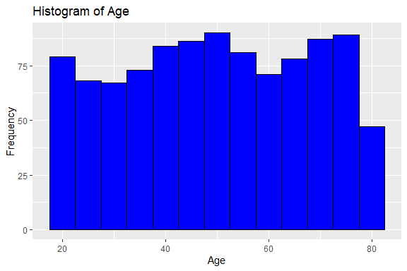
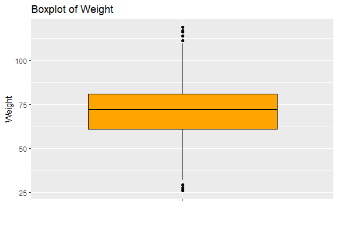
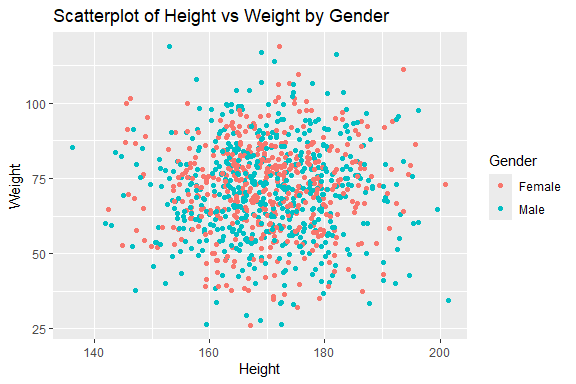
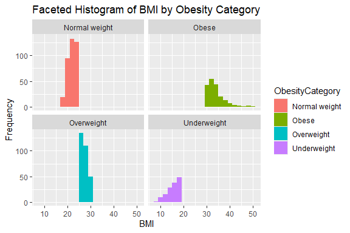

Obesity Prediction
================
Trevor Okinda
2024

- [Student Details](#student-details)
- [Setup Chunk](#setup-chunk)
  - [Source:](#source)
  - [Reference:](#reference)
- [Exploratory Data Analysis](#exploratory-data-analysis)
  - [Load dataset](#load-dataset)
  - [Measures of Frequency](#measures-of-frequency)
  - [Measures of Central Tendency](#measures-of-central-tendency)
  - [Measures of Distribution](#measures-of-distribution)
  - [Measures of Relationship](#measures-of-relationship)
  - [ANOVA](#anova)
  - [Plots](#plots)
- [Preprocessing and Data
  Transformation](#preprocessing-and-data-transformation)
  - [Missing Values](#missing-values)
  - [Round-off Columns](#round-off-columns)
- [Model Training](#model-training)
  - [Data Splitting](#data-splitting)
  - [Bootstrapping](#bootstrapping)
  - [Cross-Validation](#cross-validation)
  - [Train Different Models](#train-different-models)
  - [Performance Comparison](#performance-comparison)
- [Saving Model](#saving-model)

# Student Details

|                       |                    |
|-----------------------|--------------------|
| **Student ID Number** | 134780             |
| **Student Name**      | Trevor Okinda      |
| **BBIT 4.2 Group**    | C                  |
| **Project Name**      | Obesity Prediction |

# Setup Chunk

**Note:** the following KnitR options have been set as the global
defaults: <BR>
`knitr::opts_chunk$set(echo = TRUE, warning = FALSE, eval = TRUE, collapse = FALSE, tidy = TRUE)`.

More KnitR options are documented here
<https://bookdown.org/yihui/rmarkdown-cookbook/chunk-options.html> and
here <https://yihui.org/knitr/options/>.

### Source:

The dataset that was used can be downloaded here:
*\<<a href="https://www.kaggle.com/datasets/mrsimple07/obesity-prediction\"
class="uri">https://www.kaggle.com/datasets/mrsimple07/obesity-prediction\</a>\>*

### Reference:

*\<mrsimple07. (n.d.). Obesity prediction \[Data set\]. Kaggle.
<a href="https://www.kaggle.com/datasets/mrsimple07/obesity-prediction\"
class="uri">https://www.kaggle.com/datasets/mrsimple07/obesity-prediction\</a>\>  
Refer to the APA 7th edition manual for rules on how to cite datasets:
<https://apastyle.apa.org/style-grammar-guidelines/references/examples/data-set-references>*

# Exploratory Data Analysis

## Load dataset

``` r
# Load dataset
obesity_data <- read.csv("obesity_data.csv", colClasses = c(
  Age = "integer",
  Gender = "factor",
  Height = "numeric",
  Weight = "numeric",
  BMI = "numeric",
  PhysicalActivityLevel = "factor",
  ObesityCategory = "factor"
))

# Display the structure of the dataset
str(obesity_data)
```

    ## 'data.frame':    1000 obs. of  7 variables:
    ##  $ Age                  : int  56 69 46 32 60 25 78 38 56 75 ...
    ##  $ Gender               : Factor w/ 2 levels "Female","Male": 2 2 1 2 2 1 2 2 2 2 ...
    ##  $ Height               : num  174 164 168 168 184 ...
    ##  $ Weight               : num  72 90 72.9 84.9 69 ...
    ##  $ BMI                  : num  23.9 33.4 25.8 29.9 20.5 ...
    ##  $ PhysicalActivityLevel: Factor w/ 4 levels "1","2","3","4": 4 2 4 3 3 4 3 1 4 2 ...
    ##  $ ObesityCategory      : Factor w/ 4 levels "Normal weight",..: 1 2 3 3 1 1 3 3 1 1 ...

``` r
# View the first few rows of the dataset
head(obesity_data)
```

    ##   Age Gender   Height   Weight      BMI PhysicalActivityLevel ObesityCategory
    ## 1  56   Male 173.5753 71.98205 23.89178                     4   Normal weight
    ## 2  69   Male 164.1273 89.95926 33.39521                     2           Obese
    ## 3  46 Female 168.0722 72.93063 25.81774                     4      Overweight
    ## 4  32   Male 168.4596 84.88691 29.91225                     3      Overweight
    ## 5  60   Male 183.5686 69.03895 20.48790                     3   Normal weight
    ## 6  25 Female 166.4056 61.14587 22.08163                     4   Normal weight

``` r
# View the dataset in a separate viewer window
View(obesity_data)
```

## Measures of Frequency

``` r
# Measures of Frequency
# Count of each category in Gender
gender_counts <- table(obesity_data$Gender)
print(gender_counts)
```

    ## 
    ## Female   Male 
    ##    477    523

## Measures of Central Tendency

``` r
# Measures of Central Tendency
# Mean, Median, and Mode of Age
mean_age <- mean(obesity_data$Age)
median_age <- median(obesity_data$Age)
mode_age <- names(sort(-table(obesity_data$Age)))[1]
print(paste("Mean Age:", mean_age))
```

    ## [1] "Mean Age: 49.857"

``` r
print(paste("Median Age:", median_age))
```

    ## [1] "Median Age: 50"

``` r
print(paste("Mode Age:", mode_age))
```

    ## [1] "Mode Age: 79"

## Measures of Distribution

``` r
# Measures of Distribution
# Range of Height
height_range <- range(obesity_data$Height)
print(paste("Height Range:", height_range))
```

    ## [1] "Height Range: 136.1157192" "Height Range: 201.4196698"

``` r
# Standard Deviation of Weight
weight_sd <- sd(obesity_data$Weight)
print(paste("Weight Standard Deviation:", weight_sd))
```

    ## [1] "Weight Standard Deviation: 15.5098493162474"

## Measures of Relationship

``` r
# Measures of Relationship
# Correlation between BMI and Weight
correlation_bmi_weight <- cor(obesity_data$BMI, obesity_data$Weight)
print(paste("Correlation between BMI and Weight:", correlation_bmi_weight))
```

    ## [1] "Correlation between BMI and Weight: 0.86143815735224"

``` r
# Relationship between Gender and ObesityCategory
gender_obesity_table <- table(obesity_data$Gender, obesity_data$ObesityCategory)
print(gender_obesity_table)
```

    ##         
    ##          Normal weight Obese Overweight Underweight
    ##   Female           165    92        155          65
    ##   Male             206    99        140          78

## ANOVA

``` r
# Perform ANOVA
# Assuming you want to perform ANOVA to test the relationship between ObesityCategory and PhysicalActivityLevel
anova_result <- aov(BMI ~ PhysicalActivityLevel, data = obesity_data)

# Print ANOVA summary
print(summary(anova_result))
```

    ##                        Df Sum Sq Mean Sq F value Pr(>F)  
    ## PhysicalActivityLevel   3    300   99.88   2.616 0.0499 *
    ## Residuals             996  38027   38.18                 
    ## ---
    ## Signif. codes:  0 '***' 0.001 '**' 0.01 '*' 0.05 '.' 0.1 ' ' 1

## Plots

``` r
# Univariate Plots
library(ggplot2)
# Histogram of Age
age_hist <- ggplot(obesity_data, aes(x = Age)) +
  geom_histogram(binwidth = 5, fill = "blue", color = "black") +
  labs(title = "Histogram of Age", x = "Age", y = "Frequency")

# Boxplot of Weight
weight_boxplot <- ggplot(obesity_data, aes(x = "", y = Weight)) +
  geom_boxplot(fill = "orange", color = "black") +
  labs(title = "Boxplot of Weight", x = "", y = "Weight")

# Multivariate Plots
# Scatterplot of Height vs Weight colored by Gender
height_weight_scatter <- ggplot(obesity_data, aes(x = Height, y = Weight, color = Gender)) +
  geom_point() +
  labs(title = "Scatterplot of Height vs Weight by Gender", x = "Height", y = "Weight")

# Faceted histogram of BMI by ObesityCategory
bmi_hist_facet <- ggplot(obesity_data, aes(x = BMI, fill = ObesityCategory)) +
  geom_histogram(binwidth = 2, position = "dodge") +
  labs(title = "Faceted Histogram of BMI by Obesity Category", x = "BMI", y = "Frequency") +
  facet_wrap(~ObesityCategory)

# Display plots
print(age_hist)
```

<!-- -->

``` r
print(weight_boxplot)
```

<!-- -->

``` r
print(height_weight_scatter)
```

<!-- -->

``` r
print(bmi_hist_facet)
```

<!-- -->

# Preprocessing and Data Transformation

## Missing Values

``` r
# Check for missing values
missing_values <- sum(is.na(obesity_data))

if (missing_values > 0) {
  print("There are missing values in the dataset.")
} else {
  print("There are no missing values in the dataset.")
}
```

    ## [1] "There are no missing values in the dataset."

## Round-off Columns

``` r
# Round off numeric columns to 2 decimal places
numeric_cols <- sapply(obesity_data, is.numeric)
obesity_data[numeric_cols] <- lapply(obesity_data[numeric_cols], round, 2)

# Print first few rows of the updated dataset
head(obesity_data)
```

    ##   Age Gender Height Weight   BMI PhysicalActivityLevel ObesityCategory
    ## 1  56   Male 173.58  71.98 23.89                     4   Normal weight
    ## 2  69   Male 164.13  89.96 33.40                     2           Obese
    ## 3  46 Female 168.07  72.93 25.82                     4      Overweight
    ## 4  32   Male 168.46  84.89 29.91                     3      Overweight
    ## 5  60   Male 183.57  69.04 20.49                     3   Normal weight
    ## 6  25 Female 166.41  61.15 22.08                     4   Normal weight

# Model Training

## Data Splitting

``` r
# Set seed for reproducibility
set.seed(123)

# Split data into training and testing sets
train_index <- sample(1:nrow(obesity_data), 0.7 * nrow(obesity_data))
train_data <- obesity_data[train_index, ]
test_data <- obesity_data[-train_index, ]

# Print dimensions of training and testing sets
print(paste("Training data dimensions:", dim(train_data)))
```

    ## [1] "Training data dimensions: 700" "Training data dimensions: 7"

``` r
print(paste("Testing data dimensions:", dim(test_data)))
```

    ## [1] "Testing data dimensions: 300" "Testing data dimensions: 7"

## Bootstrapping

``` r
# Set seed for reproducibility
set.seed(123)

# Perform bootstrapping
bootstrapped_data <- replicate(100, sample(obesity_data, replace = TRUE))

# Print dimensions of bootstrapped data
print(paste("Dimensions of bootstrapped data:", dim(bootstrapped_data)))
```

    ## [1] "Dimensions of bootstrapped data: 7"  
    ## [2] "Dimensions of bootstrapped data: 100"

## Cross-Validation

``` r
library(caret)
```

    ## Loading required package: lattice

``` r
# Remove Age column
obesity_data <- obesity_data[, -which(names(obesity_data) == "Age")]

# Set seed for reproducibility
set.seed(123)

# Define cross-validation control
ctrl <- trainControl(method = "cv", number = 5)

# Fit model using cross-validation
cv_model <- train(ObesityCategory ~ ., data = obesity_data, method = "rpart", trControl = ctrl)

# Print cross-validation results
print(cv_model)
```

    ## CART 
    ## 
    ## 1000 samples
    ##    5 predictor
    ##    4 classes: 'Normal weight', 'Obese', 'Overweight', 'Underweight' 
    ## 
    ## No pre-processing
    ## Resampling: Cross-Validated (5 fold) 
    ## Summary of sample sizes: 801, 800, 800, 800, 799 
    ## Resampling results across tuning parameters:
    ## 
    ##   cp         Accuracy   Kappa    
    ##   0.2273450  0.9111493  0.8706181
    ##   0.3036566  0.7400116  0.6120648
    ##   0.4689984  0.5457151  0.2946669
    ## 
    ## Accuracy was used to select the optimal model using the largest value.
    ## The final value used for the model was cp = 0.227345.

## Train Different Models

``` r
# Train CART Model
rpart_model <- train(ObesityCategory ~ ., data = obesity_data, method = "rpart", trControl = ctrl)

# Evaluate Model
print(rpart_model)
```

    ## CART 
    ## 
    ## 1000 samples
    ##    5 predictor
    ##    4 classes: 'Normal weight', 'Obese', 'Overweight', 'Underweight' 
    ## 
    ## No pre-processing
    ## Resampling: Cross-Validated (5 fold) 
    ## Summary of sample sizes: 800, 800, 801, 800, 799 
    ## Resampling results across tuning parameters:
    ## 
    ##   cp         Accuracy   Kappa    
    ##   0.2273450  0.9121443  0.8719356
    ##   0.3036566  0.7788126  0.6716837
    ##   0.4689984  0.6057052  0.3967730
    ## 
    ## Accuracy was used to select the optimal model using the largest value.
    ## The final value used for the model was cp = 0.227345.

``` r
# Load necessary library
library(randomForest)
```

    ## randomForest 4.7-1.1

    ## Type rfNews() to see new features/changes/bug fixes.

    ## 
    ## Attaching package: 'randomForest'

    ## The following object is masked from 'package:ggplot2':
    ## 
    ##     margin

``` r
# Train Random Forest Model
rf_model <- train(ObesityCategory ~ ., data = obesity_data, method = "rf", trControl = ctrl)

# Print model
print(rf_model)
```

    ## Random Forest 
    ## 
    ## 1000 samples
    ##    5 predictor
    ##    4 classes: 'Normal weight', 'Obese', 'Overweight', 'Underweight' 
    ## 
    ## No pre-processing
    ## Resampling: Cross-Validated (5 fold) 
    ## Summary of sample sizes: 801, 800, 799, 801, 799 
    ## Resampling results across tuning parameters:
    ## 
    ##   mtry  Accuracy   Kappa    
    ##   2     0.9979999  0.9972121
    ##   4     0.9979999  0.9972136
    ##   7     0.9979999  0.9972136
    ## 
    ## Accuracy was used to select the optimal model using the largest value.
    ## The final value used for the model was mtry = 2.

``` r
# Load necessary libraries
library(caret)
library(e1071)

# Train SVM with Radial Kernel
svm_model <- train(ObesityCategory ~ ., data = obesity_data, method = "svmRadial", trControl = ctrl)

# Print model
print(svm_model)
```

    ## Support Vector Machines with Radial Basis Function Kernel 
    ## 
    ## 1000 samples
    ##    5 predictor
    ##    4 classes: 'Normal weight', 'Obese', 'Overweight', 'Underweight' 
    ## 
    ## No pre-processing
    ## Resampling: Cross-Validated (5 fold) 
    ## Summary of sample sizes: 801, 798, 800, 801, 800 
    ## Resampling results across tuning parameters:
    ## 
    ##   C     Accuracy   Kappa    
    ##   0.25  0.9139923  0.8782340
    ##   0.50  0.9289926  0.9000374
    ##   1.00  0.9419534  0.9186659
    ## 
    ## Tuning parameter 'sigma' was held constant at a value of 0.1075137
    ## Accuracy was used to select the optimal model using the largest value.
    ## The final values used for the model were sigma = 0.1075137 and C = 1.

## Performance Comparison

``` r
# Compare model performance using resamples
resamples_list <- resamples(list(rpart = rpart_model, svm = svm_model, rf = rf_model))

# Summarize performance
summary_results <- summary(resamples_list)
print(summary_results)
```

    ## 
    ## Call:
    ## summary.resamples(object = resamples_list)
    ## 
    ## Models: rpart, svm, rf 
    ## Number of resamples: 5 
    ## 
    ## Accuracy 
    ##            Min.   1st Qu.    Median      Mean 3rd Qu.      Max. NA's
    ## rpart 0.8500000 0.8550000 0.8557214 0.9121443   1.000 1.0000000    0
    ## svm   0.9296482 0.9346734 0.9350000 0.9419534   0.955 0.9554455    0
    ## rf    0.9949749 0.9950249 1.0000000 0.9979999   1.000 1.0000000    0
    ## 
    ## Kappa 
    ##            Min.   1st Qu.    Median      Mean   3rd Qu.      Max. NA's
    ## rpart 0.7815640 0.7887298 0.7893843 0.8719356 1.0000000 1.0000000    0
    ## svm   0.9004822 0.9084669 0.9093729 0.9186659 0.9373106 0.9376971    0
    ## rf    0.9929855 0.9930752 1.0000000 0.9972121 1.0000000 1.0000000    0

# Saving Model

``` r
# Saving the Random Forest model
saveRDS(rf_model, "./models/saved_rf_model.rds")

# Load the saved model
loaded_rf_model <- readRDS("./models/saved_rf_model.rds")

# Prepare new data for prediction
new_data <- data.frame(
  Gender = "Male",
  Height = 175,
  Weight = 80,
  BMI = 26,
  PhysicalActivityLevel = "3"
)

# Use the loaded model to make predictions
predictions_loaded_model <- predict(loaded_rf_model, newdata = new_data)

# Print predictions
print(predictions_loaded_model)
```

    ## [1] Overweight
    ## Levels: Normal weight Obese Overweight Underweight
